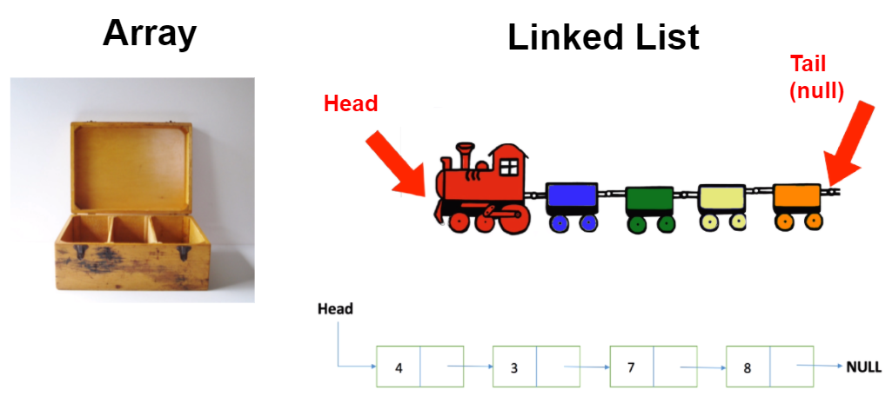
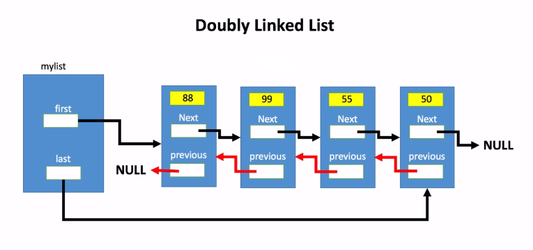

> ***After demoing the following content**, be sure to complete this [Hackerrank Challenge](https://www.hackerrank.com/challenges/30-linked-list/problem) 👈*

# Linked Lists
- A Linked List is a data structure for storing a collection of items (like an array!).  
- Linked Lists are dynamic meaning that they can increase or decrease in size. 
- Linked Lists allow you to insert data, shifting over all the other elements in the collection. See the below two images to understand the differences between an Array and a LinkedList.

Notice that the Array is static and cannot be re-sized whereas the Linked List can have more elements (which we'll call **Nodes** added to it.)

The first and last node of a linked list usually are called the head and tail of the list, respectively. Thus, we can traverse the list starting at the head and ending at the tail. **The tail node is a special node, where the next pointer is always pointing or linking to a null reference, indicating the end of the list.**



Here you can add a cart (node) to either the head, tail, or right in the middle.

Each **node** within a Linked List may follow this class definition:

<br>

```java
public class Node {
	public int data; // Imagine that each element in this Linked List is an Integer
	public Node next; // Represents neighboring Node
	
	public void displayNode(){
		System.out.println("{ "+ data + " } ");
	}
}
```

<br>

Following the image featured in the above diagram, in the `App.java` class of your `com.revature.singlylinkedlist` demo, instantiate several nodes.

Afterwards, create a method that counts how many nodes are connected to a node passed in as the `HEAD`.  When you have solved the challenge, go ahead and create the `SinglyLinkedList.java` class to demonstrate a Simple Linked List.

<br>

## Singly Linked List
A singly linked list defined as all nodes are linked together in a few sequential manners, hence, it also knows as a linear linked list.

Therefore, clearly it has the beginning and the end. The main problem which comes with this list is that we cannot access the predecessor of the node from the current node.

#### Advantages
- Insertions and Deletions can be done easily. **O(1)**
- It space is not wasted as we can get space according to our requirements.

#### Disadvantages
- Accessing the preceding node of a current node is not possible as there is no backward traversal.
-  If we have to go to a particular element then we have to go through all those elements that come before that element. **O(n)**
-  We can not traverse it from last - only from the beginning.

<br>

## Doubly Linked List
A doubly linked list is a linear data structure similar to a singly linked list but here each node has an extra pointer that stores the address of the previous node corresponding to each node.

> *Internally, the `java.util.LinkedList` is implemented using a Doubly Linked List Data Structure*



#### Advantages:
- Allows us to iterate in both directions.
- We can delete a node easily as we have access to its previous node.
- Reversing is easy.
 
#### Disadvantages:
- Compared to a singly linked list, each node store an extra pointer which consumes extra memory. 	- Operations require more time due to the overhead of handling extra pointers as compared to singly-linked lists.

#### Uses:
- It can be used to implement various other data structures like hash-tables, stacks, binary trees etc.
- Can be used to implement functionalities such as undo/redo.
- Can be used in any software which requires forward and backward navigation e.g. music players, in web-browsers to move between previously visited and current page etc.
- Used by a thread scheduler in many operating systems to maintain a list of all running processes.
- Can also be used in games e.g. representing a deck of cards. 
